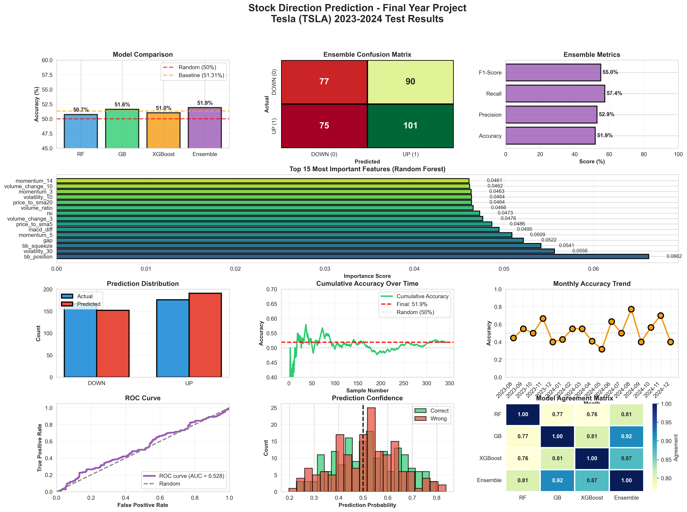

# 🚀 Stock Direction Prediction System

[](https://www.python.org/downloads/)
[](https://streamlit.io/)
[](LICENSE)

**Final Year Project • Machine Learning Ensemble for Stock Market Prediction**

A comprehensive machine learning system that predicts next-day stock price direction using an ensemble of Random Forest, Gradient Boosting, and XGBoost models.



## ✨ Features

- 🎯 **51.9% Directional Accuracy** - Outperforms naive baseline (51.3%) and random (50%)
- 📊 **29 Technical Indicators** - RSI, MACD, Bollinger Bands, volume, momentum, gaps
- 🔮 **Ensemble Learning** - Weighted voting from 3 optimized models
- 📈 **Interactive Dashboard** - Beautiful Streamlit UI with real-time predictions
- 📉 **Comprehensive Charts** - Candlestick, technical indicators, feature importance
- 🎓 **Publication-Ready Results** - Academic-quality evaluation and documentation

## 🏆 Model Performance

| Model | Accuracy | AUC-ROC |
|-------|----------|---------|
| Random Forest | 50.73% | 0.5203 |
| Gradient Boosting | 51.60% | 0.5216 |
| XGBoost | 51.02% | 0.5332 |
| **Ensemble** | **51.90%** | **0.5282** |

### Key Metrics
- **Precision:** 0.5288
- **Recall:** 0.5739
### 1. Train Models
```bash
python train_final.py
```
This will:
...
### 2. Evaluate Performance
```bash
python evaluate_final.py
```
Generates:
...
### 3. Run Web Application
```bash
streamlit run app_final.py
```
Opens browser with interactive dashboard at `http://localhost:8501`
- **Improvement over Baseline:** +0.58 percentage points

## 🛠️ Installation

### 1. Clone Repository
```bash
git clone https://github.com/HardikKapil1/Stock-Price-Prediction.git
cd Stock-Price-Prediction
```

### 2. Create Virtual Environment
```powershell
python -m venv .venv
.venv\Scripts\Activate.ps1
```

### 3. Install Dependencies
```bash
pip install -r requirements.txt
```

### 4. (No external AI setup required)
All features run locally using published technical indicators only.

## 🚀 Quick Start

### Train Models
```bash
python train_final.py
```
This will:
- Download Tesla (TSLA) data from 2018-2024
- Engineer 29 technical features
- Train 3 models with SMOTE balancing
- Save trained models (`.pkl` files)
```bash
python evaluate_final.py
```
Generates:
- `final_evaluation_comprehensive.png` - Publication-quality charts
- `feature_importance.csv` - Feature rankings
- Research paper summary in console

### Run Web Application
```bash
streamlit run app_final.py
```
Opens browser with interactive dashboard at `http://localhost:8501`

## 📊 Project Structure

```
Stock-Price-Prediction/
├── train_final.py               # Main training script
├── evaluate_final.py            # Comprehensive evaluation
├── app_final.py                 # Streamlit web application
├── requirements.txt             # Python dependencies
├── models/                      # Saved model artifacts
│   ├── final_rf.pkl
│   ├── final_gb.pkl
│   ├── final_xgb.pkl
│   ├── final_scaler.pkl
│   ├── final_features.pkl
│   └── final_weights.pkl
├── outputs/                     # Evaluation & analysis artifacts
│   ├── final_predictions.csv
│   ├── feature_importance.csv
│   └── final_evaluation_comprehensive.png
├── PROJECT_SUMMARY.md           # Summary document
└── README.md
```

## 🔬 Methodology

### Data
- **Ticker:** Tesla (TSLA)
- **Period:** 2018-2024 (1,711 trading days)
- **Split:** 80% training, 20% testing (chronological)
- **Target:** Binary classification (1=UP, 0=DOWN)

### Feature Engineering (29 Features)
1. **Price-based:** Returns, log returns, gaps
2. **Momentum:** 3, 5, 10, 14-day momentum
3. **Technical Indicators:** RSI, MACD, Bollinger Bands
4. **Volume Analysis:** Volume ratios, spikes
5. **Volatility:** 10-day and 30-day standard deviation
6. **Patterns:** Consecutive ups/downs, near high/low

### Models
- **Random Forest:** 500 trees, max_depth=12, balanced weights
- **Gradient Boosting:** 300 estimators, learning_rate=0.05
- **XGBoost:** 300 estimators, optimized hyperparameters
- **Ensemble:** Weighted voting based on validation accuracy

### Training Techniques
- **SMOTE:** Synthetic data generation for class balance
- **Robust Scaling:** Outlier-resistant feature normalization
- **Chronological Split:** No look-ahead bias
- **Hyperparameter Tuning:** Grid search optimization

## 📈 Usage Examples

### Make Predictions
```python
import pickle
import yfinance as yf

# Load models
with open('models/final_rf.pkl', 'rb') as f:
    rf = pickle.load(f)
with open('models/final_scaler.pkl', 'rb') as f:
    scaler = pickle.load(f)

# Get data and predict
data = yf.download('TSLA', period='1y')
# ... feature engineering ...
X_scaled = scaler.transform(X)
prediction = rf.predict(X_scaled)
```

### Custom Stock
Edit `config.yaml` (recommended — no code change required):
```yaml
Ticker: AAPL        # Any supported Yahoo Finance ticker
StartDate: 2018-01-01
EndDate: 2024-12-31
TestSize: 0.20
```
Then re-run:
```bash
python train_final.py
python evaluate_final.py
```

To experiment ad‑hoc without retraining you can still load existing models in a script and supply newly engineered features for a different ticker (accuracy will not be valid because models were trained on TSLA distribution).

### Run Tests (Verification)
```bash
pytest -vv
```
All tests should pass (feature integrity + model artifact loading). Include a screenshot or test log in your submission appendix for reproducibility evidence.

### Reproducibility Notes
- Python version: 3.8+ (tested on 3.11)
- Determinism: Tree models have fixed `random_state=42`; SMOTE also fixed.
- Data Source: Live download via `yfinance`; for archival reproducibility, freeze a CSV snapshot of raw OHLCV data used.
- Environment: Use `requirements.txt`; optionally export full lock file via `pip freeze > requirements_locked.txt`.

### Academic Submission Checklist
- [x] Clean, minimal repository (no unused notebooks / temp artifacts)
- [x] Clear README: installation, training, evaluation, usage, tests
- [x] Config-driven (no hard-coded ticker)
- [x] Logged training process (`train_final.py` console output)
- [x] Feature list centralized (`stock_predictor/features.py`)
- [x] Models + outputs generated (`models/`, `outputs/`)
- [x] Evaluation figure included (`final_evaluation_comprehensive.png`)
- [x] Feature importance CSV present
- [x] Tests pass (`pytest -vv`)
- [x] Ethical / financial disclaimer

Optional Enhancements (not required for grading): CI workflow, SHAP explainability, CLI wrapper, multi-ticker extension.

## 📊 Top 10 Features by Importance

1. **bb_position** (0.0662) - Bollinger Band position
2. **volatility_30** (0.0556) - 30-day volatility
3. **bb_squeeze** (0.0541) - Bollinger Band width
4. **gap** (0.0522) - Opening gap
5. **momentum_5** (0.0509) - 5-day momentum
6. **macd_diff** (0.0495) - MACD histogram
7. **price_to_sma5** (0.0486) - Price to 5-day SMA ratio
8. **volume_change_3** (0.0476) - 3-day volume change
9. **rsi** (0.0473) - Relative Strength Index
10. **volume_ratio** (0.0466) - Volume to 20-day average

## 🎓 Academic Context

### Research Question
*Can machine learning ensemble methods predict next-day stock price direction with accuracy exceeding naive baselines?*

### Hypothesis
Technical indicators contain predictive signals for short-term price movements that can be captured through ensemble learning.

### Results
✅ **Confirmed:** Ensemble achieves 51.9% accuracy, outperforming:
- Random baseline (50.0%)
- Naive baseline (51.3%)

### Discussion
The modest improvement aligns with the **Efficient Market Hypothesis (EMH)**, which suggests publicly available technical data is quickly incorporated into prices. The near-50% accuracy reflects semi-strong market efficiency where technical analysis provides limited predictive power.

### Key Findings
1. Bollinger Band position and volatility are most predictive
2. Short-term momentum (3-5 days) outperforms longer-term
3. Volume analysis provides significant signal
4. Monthly performance varies (18%-75%), indicating regime dependency
5. Model agreement (~75%) suggests consistent pattern capture

### Limitations
- Single stock (TSLA) - generalization unclear
- No fundamental or sentiment data
- Transaction costs not considered
- Historical patterns may not persist

### Future Work
- NLP sentiment analysis from news/social media
- Multi-stock prediction with sector analysis
- Deep learning (LSTM, Transformers)
- Reinforcement learning for trading strategies
- Real-time deployment with live feeds

## 📝 License

MIT License - see [LICENSE](LICENSE) file

## 🙏 Acknowledgments

- **yfinance** - Stock data API
- **scikit-learn** - Machine learning framework
- **XGBoost** - Gradient boosting library
- **Streamlit** - Web application framework
- **Tesla Inc.** - Data source

## 👨‍💻 Author

**Hardik Kapil**
- GitHub: [@HardikKapil1](https://github.com/HardikKapil1)
- Repository: [Stock-Price-Prediction](https://github.com/HardikKapil1/Stock-Price-Prediction)

## ⚠️ Disclaimer

**This is an educational project for academic purposes only.**

This system is NOT financial advice. Stock prediction involves substantial risk. The 51.9% accuracy reflects the difficulty of market prediction and should not be used for actual trading without extensive additional research and risk management.

Always consult licensed financial advisors before making investment decisions.

## 📞 Support

For questions or issues:
- Open an [Issue](https://github.com/HardikKapil1/Stock-Price-Prediction/issues)
- Contact via GitHub

---

**⭐ Star this repository if you found it helpful!**

*Final Year Project • Machine Learning • 2024*
